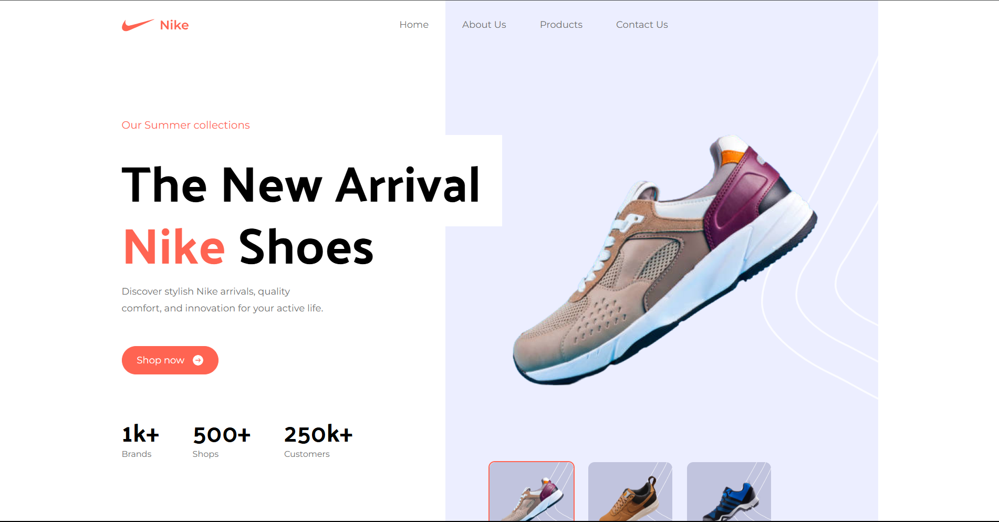

Here’s your updated README with a **live demo link** and **GitHub repository URL** placeholders.

---

## 🏀 Nike - Website



Welcome to **Nike - Website**, a modern and responsive e-commerce UI built with **React and Tailwind CSS**. This project is part of my **Tailwind mastery journey**, where I focus on building high-quality, scalable, and visually appealing web interfaces.

## 🔗 **Live Demo:** [Nike Website](https://nike-tailwind-mastery.vercel.app/)

## 🚀 Features

✅ **Fully Responsive** – Optimized for all screen sizes  
✅ **Modern UI** – Clean and sleek Nike-inspired design  
✅ **Reusable Components** – Built using modular React components  
✅ **Tailwind CSS** – Styled with utility-first Tailwind classes  
✅ **Interactive Sections** – Includes hero banners, product listings, and testimonials

---

## 🛠️ Tech Stack

- **React.js** – Component-based UI library
- **Tailwind CSS** – Utility-first styling framework
- **Vite** – Fast development build tool

---

## 📂 Project Structure

```
/src
 ├── /components  # Reusable UI components (Navbar, Buttons, etc.)
 ├── /sections    # Page sections (Hero, Products, Services, etc.)
 ├── /assets      # Images, icons, and fonts
 ├── App.jsx      # Main application entry
 ├── main.jsx     # Renders App component
 └── index.css    # Global styles
```

---

## 🔧 Installation & Setup

1️⃣ Clone the repository:

```bash
git clone https://github.com/alhiefikri/nike-website.git
cd nike-website
```

2️⃣ Install dependencies:

```bash
npm install
```

3️⃣ Run the development server:

```bash
npm run dev
```

Your project will be live at `http://localhost:5173` 🚀

---

## 📸 Preview


---

## 📌 Future Improvements

🚀 Add animations with Framer Motion  
🎨 Implement a dark mode toggle  
🛒 Integrate product filtering and search

---

## 💡 Why This Project?

This project is my **hands-on practice for mastering Tailwind CSS in a real-world UI project**. By building this, I aim to enhance my skills in designing modern, responsive web apps with React and Tailwind.

---

### ⭐ Feedback & Contributions

If you have any suggestions, feel free to open an issue or contribute!
